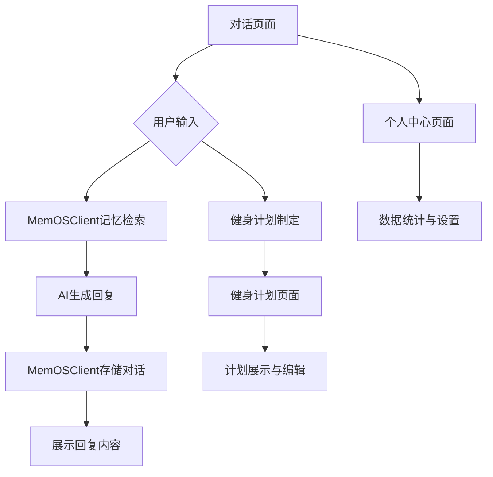
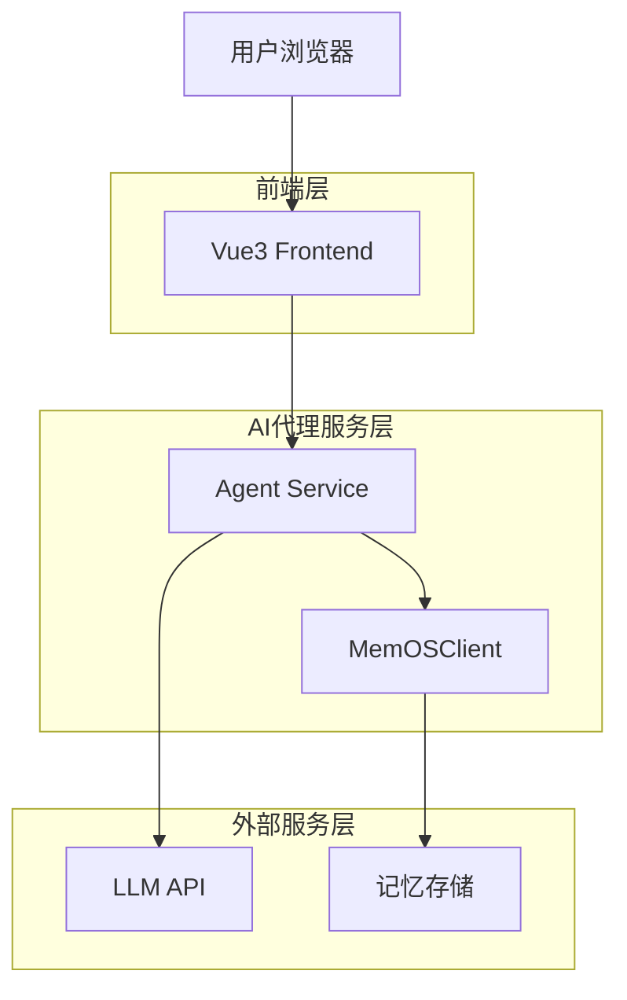
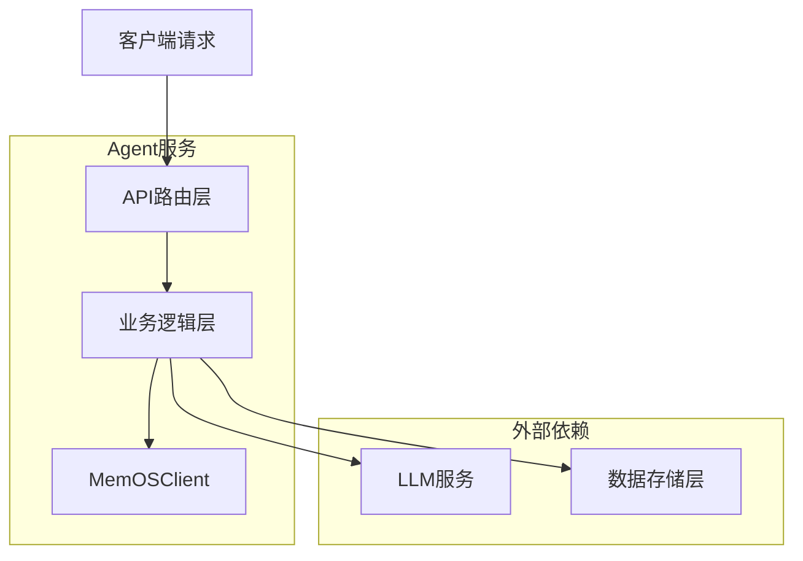
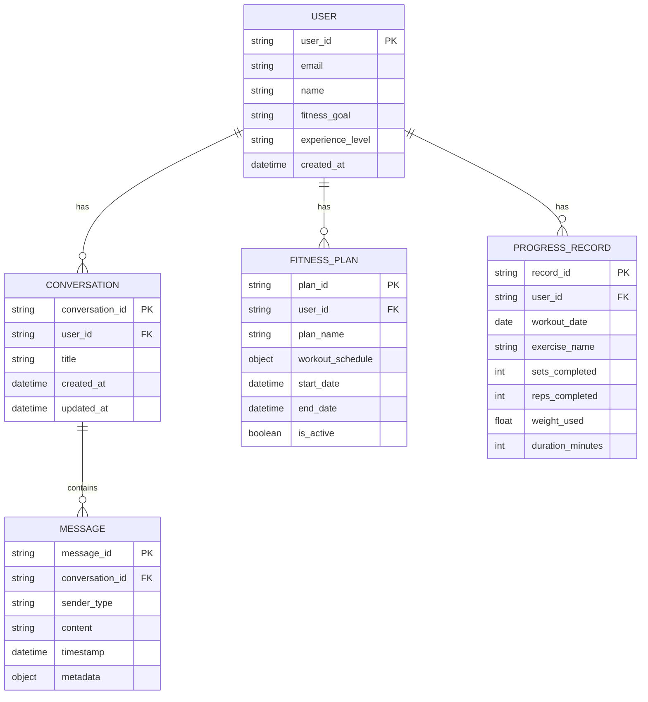

## 1. 产品概述

轻量级个人AI健身助理 - 一个具备长时记忆能力的个性化健身智能助手。通过MemOSClient技术实现对话记忆存储与检索，为用户提供个性化的健身建议、计划制定、执行监督和情感陪伴。

解决用户在健身过程中缺乏个性化指导、难以坚持、缺乏专业建议的问题，让每个人都能拥有专属的AI健身伙伴。

## 2. 核心功能

### 2.1 用户角色

| 角色     | 注册方式        | 核心权限                         |
| -------- | --------------- | -------------------------------- |
| 普通用户 | 邮箱/手机号注册 | 基础健身咨询、计划制定、对话记忆 |
| 高级用户 | 付费升级        | 高级训练计划、营养建议、数据分析 |

### 2.2 功能模块

健身AI助理包含以下核心页面：

1. **对话页面**：AI健身助手交互界面，支持文字对话、语音输入、记忆检索
2. **健身计划页面**：个性化训练计划展示、编辑、进度跟踪
3. **个人中心页面**：用户信息、健身数据、设置管理

### 2.3 页面详情

| 页面名称     | 模块名称     | 功能描述                                                              |
| ------------ | ------------ | --------------------------------------------------------------------- |
| 对话页面     | AI对话模块   | 接收用户输入，调用MemOSClient检索相关记忆，结合健身知识生成个性化回复 |
| 对话页面     | 记忆检索模块 | 实时检索用户历史对话和健身数据，为AI提供上下文信息                    |
| 对话页面     | 语音输入模块 | 支持语音转文字，提升交互便捷性                                        |
| 健身计划页面 | 计划展示模块 | 显示当前训练计划、运动项目、组数次数等详细信息                        |
| 健身计划页面 | 进度跟踪模块 | 记录每日完成情况，可视化展示训练进度                                  |
| 健身计划页面 | 计划编辑模块 | 允许用户自定义调整训练计划内容和难度                                  |
| 个人中心页面 | 用户信息模块 | 展示基本信息、健身目标、身体状况等                                    |
| 个人中心页面 | 数据统计模块 | 显示训练时长、消耗卡路里、坚持天数等统计数据                          |
| 个人中心页面 | 设置管理模块 | 账号设置、通知偏好、隐私设置等                                        |

## 3. 核心流程

### 用户对话流程

1. 用户进入对话页面，输入健身相关问题或需求
2. 系统调用MemOSClient检索用户历史对话和健身数据
3. AI结合检索到的记忆信息和健身知识库生成个性化回复
4. 系统将对话内容通过MemOSClient存储，更新用户记忆

### 健身计划制定流程

1. 用户在对话中表达健身目标或需求
2. AI分析用户身体状况、时间安排、目标等信息
3. 生成个性化训练计划并展示在健身计划页面
4. 用户可在计划页面查看、编辑和调整训练内容



## 5. 技术实现说明

### 5.1 前端技术选型

- **框架**: Vue3@3.4 - 采用Composition API，提供优秀的TypeScript支持
- **构建工具**: Vite@5 - 快速的开发服务器和构建工具
- **UI组件库**: Element Plus@2 - 基于Vue3的企业级组件库
- **状态管理**: Pinia - Vue官方推荐的状态管理库
- **路由**: Vue Router@4 - Vue3官方路由管理器
- **HTTP客户端**: Axios - 用于与后端API通信
- **CSS框架**: TailwindCSS@3 - 实用优先的CSS框架

### 5.2 Vue3组件结构设计

```
src/
├── components/           # 通用组件
│   ├── Chat/          # 聊天相关组件
│   │   ├── ChatMessage.vue
│   │   ├── ChatInput.vue
│   │   └── VoiceInput.vue
│   ├── Plan/          # 健身计划组件
│   │   ├── PlanCard.vue
│   │   ├── ProgressChart.vue
│   │   └── ExerciseList.vue
│   └── Profile/       # 个人中心组件
│       ├── UserInfo.vue
│       ├── StatsPanel.vue
│       └── Settings.vue
├── views/               # 页面组件
│   ├── ChatView.vue
│   ├── PlanView.vue
│   └── ProfileView.vue
├── stores/              # Pinia状态管理
│   ├── chat.ts        # 对话状态
│   ├── plan.ts        # 计划状态
│   └── user.ts        # 用户状态
├── services/           # API服务
│   ├── api.ts         # API接口封装
│   ├── memos.ts       # MemOSClient集成
│   └── speech.ts      # 语音识别服务
└── utils/              # 工具函数
    ├── date.ts        # 日期处理
    └── format.ts      # 数据格式化
```

### 5.3 MemOSClient集成方案

保持原有的MemOSClient记忆方案不变，在Vue3中的集成方式：

- **安装**: 保持原有的memos.api.client依赖
- **初始化**: 在Vue3的composition API中初始化MemOSClient
- **使用**: 通过Pinia store管理记忆数据的检索和存储
- **组件集成**: 在ChatView组件中调用记忆检索服务

### 5.4 前后端通信

- **API调用**: 使用Axios封装统一的API调用方法
- **WebSocket**: 考虑使用WebSocket实现实时对话功能
- **错误处理**: 统一的错误处理和用户提示机制
- **数据缓存**: 使用Pinia进行数据缓存，减少不必要的API调用

## 6. 架构设计



## 7. 技术描述

- **前端**: Vue3@3.4 + Vite@5 + Element Plus@2
- **初始化工具**: vite-init
- **后端**: Python FastAPI (AI Agent服务)
- **记忆系统**: MemOSClient (from memos.api.client)
- **AI模型**: 大语言模型API (支持OpenAI、Claude等)

## 8. 路由定义

| 路由      | 用途                             |
| --------- | -------------------------------- |
| /         | 对话页面，主要的AI交互界面       |
| /plan     | 健身计划页面，展示和管理训练计划 |
| /profile  | 个人中心页面，用户信息和数据统计 |
| /settings | 设置页面，账号和偏好设置         |

## 9. API定义

### 9.1 对话相关API

**发送消息**

```
POST /api/chat/send
```

请求:

| 参数名  | 参数类型 | 是否必需 | 描述           |
| ------- | -------- | -------- | -------------- |
| user_id | string   | true     | 用户ID         |
| message | string   | true     | 用户输入的消息 |
| context | object   | false    | 对话上下文信息 |

响应:

| 参数名           | 参数类型 | 描述               |
| ---------------- | -------- | ------------------ |
| reply            | string   | AI回复内容         |
| memory_used      | boolean  | 是否使用了记忆检索 |
| related_memories | array    | 相关的记忆片段     |

示例:

```json
{
  "user_id": "user_123",
  "message": "我想制定一个减脂训练计划",
  "context": {
    "fitness_goal": "减脂",
    "experience_level": "初级"
  }
}
```

### 9.2 健身计划API

**获取用户计划**

```
GET /api/plan/:user_id
```

**更新计划进度**

```
POST /api/plan/progress
```

### 9.3 用户管理API

**用户注册/登录**

```
POST /api/auth/login
```

**获取用户信息**

```
GET /api/user/:user_id
```

## 9. 服务器架构图



## 10. 数据模型

### 10.1 核心数据实体   



### 10.2 数据定义

**用户表 (users)**

```sql
CREATE TABLE users (
    user_id VARCHAR(50) PRIMARY KEY,
    email VARCHAR(255) UNIQUE NOT NULL,
    name VARCHAR(100) NOT NULL,
    fitness_goal VARCHAR(50),
    experience_level VARCHAR(20) DEFAULT 'beginner',
    created_at TIMESTAMP DEFAULT CURRENT_TIMESTAMP,
    updated_at TIMESTAMP DEFAULT CURRENT_TIMESTAMP
);
```

**对话表 (conversations)**

```sql
CREATE TABLE conversations (
    conversation_id VARCHAR(50) PRIMARY KEY,
    user_id VARCHAR(50) REFERENCES users(user_id),
    title VARCHAR(200),
    created_at TIMESTAMP DEFAULT CURRENT_TIMESTAMP,
    updated_at TIMESTAMP DEFAULT CURRENT_TIMESTAMP
);
```

**消息表 (messages)**

```sql
CREATE TABLE messages (
    message_id VARCHAR(50) PRIMARY KEY,
    conversation_id VARCHAR(50) REFERENCES conversations(conversation_id),
    sender_type VARCHAR(20) CHECK (sender_type IN ('user', 'assistant')),
    content TEXT NOT NULL,
    timestamp TIMESTAMP DEFAULT CURRENT_TIMESTAMP,
    metadata JSONB
);
```

## 11. MemOSClient集成设计

### 11.1 记忆存储策略

- **对话记忆**: 将用户与AI的对话内容按主题分类存储
- **健身数据记忆**: 存储用户的训练记录、偏好、目标变化等
- **上下文记忆**: 保存用户的身体状况、时间安排、偏好设置等

### 11.2 记忆检索机制   

- **语义检索**: 基于用户当前输入，检索最相关的历史对话
- **时间权重**: 优先考虑最近的、高频的互动记忆
- **个性化权重**: 根据用户反馈调整记忆的重要性权重

### 11.3 记忆更新策略

- **增量更新**: 每次对话后更新相关记忆片段
- **定期整理**: 定期合并相似记忆，删除过时信息
- **用户反馈**: 允许用户对AI回复进行反馈，优化记忆质量

## 12. Vue3前端架构设计

### 12.1 项目结构   

```
fitness-ai-vue3/
├── src/
│   ├── components/          # 通用组件
│   │   ├── Chat/           # 聊天组件
│   │   ├── Plan/           # 健身计划组件
│   │   └── Profile/        # 个人中心组件
│   ├── views/              # 页面组件
│   ├── stores/             # Pinia状态管理
│   ├── services/           # API服务
│   ├── utils/              # 工具函数
│   ├── types/              # TypeScript类型定义
│   └── assets/             # 静态资源
├── public/                 # 公共资源
├── package.json
├── vite.config.ts
├── tsconfig.json
└── tailwind.config.js
```

### 12.2 核心依赖

```json
{
  "dependencies": {
    "vue": "^3.4.0",
    "vue-router": "^4.2.0",
    "pinia": "^2.1.0",
    "element-plus": "^2.4.0",
    "axios": "^1.6.0",
    "@element-plus/icons-vue": "^2.3.0",
    "memos.api.client": "^1.0.0"
  },
  "devDependencies": {
    "@vitejs/plugin-vue": "^4.5.0",
    "vite": "^5.0.0",
    "typescript": "^5.3.0",
    "tailwindcss": "^3.3.0",
    "autoprefixer": "^10.4.0",
    "postcss": "^8.4.0"
  }
}
```

### 12.3 状态管理设计

- **ChatStore**: 管理对话状态、消息历史、记忆检索结果
- **PlanStore**: 管理健身计划、进度跟踪、计划编辑
- **UserStore**: 管理用户信息、登录状态、偏好设置
- **AppStore**: 管理全局状态、加载状态、错误处理

### 12.4 组件通信

- **Props/Emit**: 父子组件通信
- **Provide/Inject**: 跨层级组件通信
- **Pinia**: 全局状态管理
- **Event Bus**: 全局事件总线（用于组件解耦）

## 13.部署方式（新增，贴合项目）
### 13.1后端部署
- 开发环境：
  - 设置环境变量：
    - `export MEMOS_API_KEY='你的memos_key'`
    - `export OPENAI_API_KEY='你的openai_key'`
  - 启动服务：
    - `python3 -m uvicorn agent_mem.Fitness_assistance.server.main:app --host 0.0.0.0 --port 8000`
- 生产环境（systemd 简版）：
  - `Environment="MEMOS_API_KEY=..."`
  - `Environment="OPENAI_API_KEY=..."`
  - `ExecStart=/usr/bin/python3 -m uvicorn agent_mem.Fitness_assistance.server.main:app --host 0.0.0.0 --port 8000`

### 13.2前端部署
- 开发：
  - `cd Fitness_assistance/`
  - `npm install && npm run dev`（默认 `http://localhost:5173`，端口占用自动切换）
- 生产（静态站点）：
  - 构建：`npm run build`，部署 `dist/`
  - Nginx 反代接口：
    - `location /api/ { proxy_pass http://127.0.0.1:8000/api; }`
  - 本地预览：`npm run preview`
